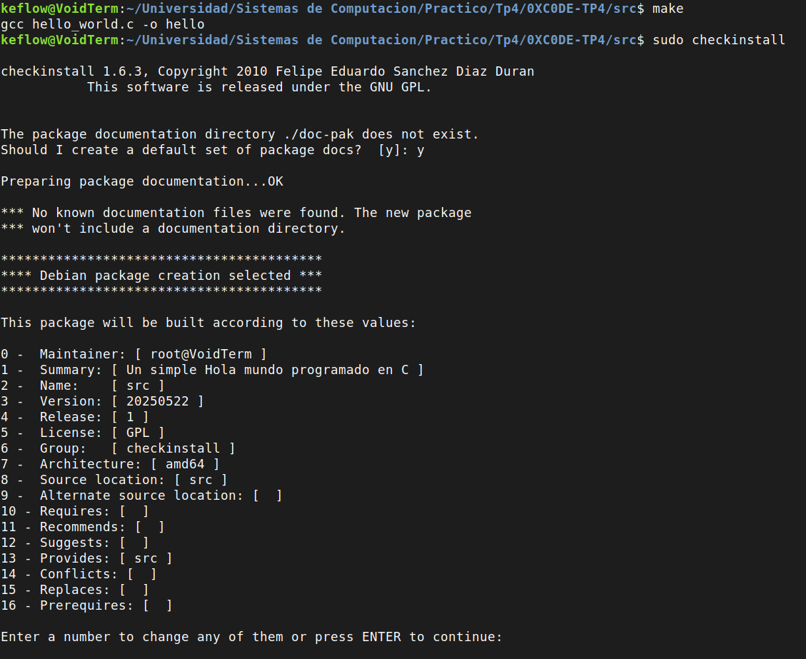
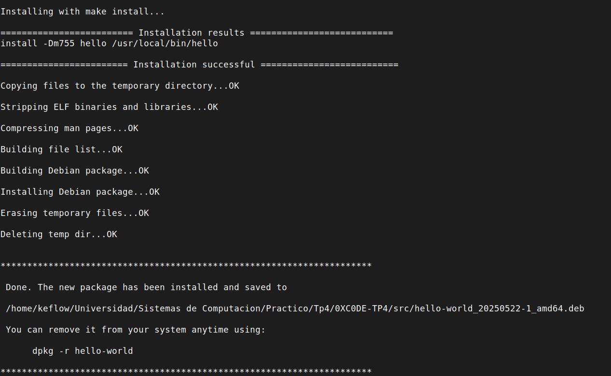
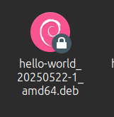
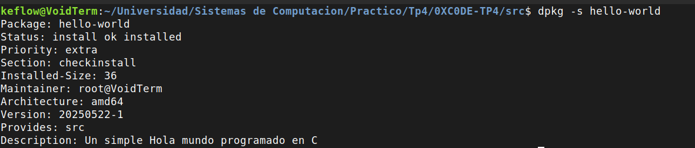

# 0XC0DE - Sistemas de Computación Tp4

## Modulos de Kernel
Un Módulo de Kernel Linux se define como un segmento de codigo capaz de cargarse y descargarse dinámicamente dentro del kernel según sea necesario.
Estos módulos mejoran las capacidades del núcleo sin necesidad de reiniciar el sistema. 
Un ejemplo notable es el módulo de controlador de dispositivo, que facilita la interacción del núcleo con los componentes de Hardware vinculados al sistema. 

En ausencia de módulos, el enfoque predominante se inclina hacia los núcleos monoliticos, que requieren la integración directa de nuevas funcionalidades en la imagen del núcleo.

Este enfoque da lugar a núcleos más grandes y requiere la reconstrucción del núcleo y el subsiguiente reinicio del sistema cuando se desean nuevas funcionalidades.

### **¿Qué es checkinstall y para qué sirve?**

Generalmente en entorno Linux, cuando se compila software desde un código fuente, el proceso es casi siempre el mismo. 

Primero se crea un archivo **Makefile** que contiene las instrucciones para el proceso de compilación, especificando como compilar y enlazar los archivos fuente:
```
make 
sudo make install
```

El último comando es opcional y lo que hace es que **make install** copia directamente los archivos binarios y de configuracion al sistema de archivos, en donde las rutas mas típicas son: */usr/local/bin* , */usr/local/lib*. 

Este método es funcional pero no gestiona de la mejor manera la ubicación ya que no existe ningun registro de que archivos fueron instalados y en donde, al momento de desinstalar el software pueden quedar algunos archivos residuales, rompe la trazabilidad del sistema ya que el gestor de paquetes que tenemos no sabe nada del software instalado.

**Checkinstall** es una herramienta que resuelve todos estos problemas actuando como el reemplazo del comando **make install**.

Entonces, en lugar de instalar los archivos directamente en el sistema, Checkinstall monitorea los archivos que se copiarán durante la instalación y crea un paquete instalable para el sistema de gestion de paquetes que estemos usando (apt o dnf), esto incluye los formatos del tipo **.deb** (Debian, Ubuntu y derivados), **.rpm** (Fedora, Red Hat) y **.tgz** (Slackware).

Despues de hacer esto instala el paquete creado de manera controlada, registrandolo en la base de datos del sistema de paquetes.

Algunas ventajas de usar esta herramienta:
   
- Se sabe exactamente que archivos se instalaron y donde
- Es facil de eliminar el software, se puede utilizar **apt remove** o el comando equivalente.
- Previene posibles futuros conflictos ya que detecta si otro software intenta sobrescribir los mismos archivos.
- Es auditable ya que mantiene su trazabilidad.

### Crear un Hello_world y empaquetarlo

Primero escribimos el siguiente programa en C que contiene un hola mundo:
``` code
#include <stdio.h>
int main(){
    printf("Hola mundo! \n");
    return 0;
}
```

Para cumplir las normas de la utilización de la herramienta de Checkinstall necesitamos crear un **Makefile** y un **description-pak**.

Una vez creados, ejecutamos los siguientes comandos en la consola:

``` bash
make
sudo checkinstall
```

La consola mostrará la siguiente salida:



en donde podemos cambiarle el nombre a nuestro paquete a **hello-world**

Luego de esto, la consola muestra la siguiente salida:



Despues de esto ya tenemos nuestro codigo de Hola mundo! creado y empaquetado, se ve de la siguiente manera:



Y podemos corroborar ingresando lo siguiente en consola:



Para desinstalar este paquete, podemos utilizar lo siguiente:

``` bash
sudo dpkg -r hello-world
```
### Seguridad del Kernel
**Rootkits:** es un software malicioso que da acceso privilegiado al sistema mientras se oculta, modificando el kernel u otros componentes.

Dado que la seguridad del kernel de linux es importante para proteger sistemas contra amenazas como los modulos no firmados y rootkits. A continuación nombramos algunas de las medidas que podemos implementar para mejorar la seguridad del Kernel.

- **Firmar módulos del Kernel:** El kernel de linux permite extender sus funcionalidades mediante módulos, que son piezas de codigo cargadas dinamicamente.
    El hecho de tener módulos no firmados pueden representar riesgos ya que podrian contener algún tipo de malware.
    
    En sistemas con **Secure Boot**, los módulos deben estar firmados con una clave privada y verificados con la clave pública


- **Habilitar Secure Boot:**
    Esto se encuentra disponible en firmware UEFI y requiere que todos los cargadores de arranque y módulos de kernel esten firmados con claves de confianza

- **Configurar module.sig_enforce:** esto se utiliza para rechazar los módulos sin firma.+

### ¿Qué funciones tiene disponible un programa y un módulo?
Primero definimos algunos conceptos:

**Programa:** en un espacio de usuario, es una aplicación que corre en el entorno del usuario. Estas aplicaciones interactúan con el sistema operativo a traves de interfaces definidas, usando bibliotecas estándares y llamadas al sistema.

**Módulo de kernel:** es un componente que se carga dinámicamente en el kernel de Linux para extender su funcionalidad. Estos operan en el espacio de kernel, donde las reglas son más estrictas para garantizar la estabilidad y seguridad del sistema.

Los programas, al tener una libreria estandar de C, tienen un amplia gama de funciones proporcionadas por la biblioteca estándar de C, algunas funciones son: *printf(), malloc(), fread(), fwrite().*
Ademas de esto, los programas pueden realizar llamadas al sistema (System calls). Algunos comandos son: *open(), read(), write()*

Los módulos de kernel no tienen acceso a las bibliotecas standar de C, por lo que los modulos unicamente tienen acceso a funciones especificas proporcionadas por el kernel como por ejemplo, gestion de dispositivos, interrupciones, comunicacion directa con el hardware. El archivo /proc/kallsyms contiene todos los simbolos que el kernel conoce, por lo que son accesible para sus módulos ya que comparten el espacio de código del kernel.

### Espacio de Usuario - Espacio de Kernel
El **espacio de usuario** es el entorno en donde se ejecutan las aplicaciones de usuario (navegadores, editores de texto, etc). Estas aplicaciones estan aisladas del hardware y de la memoria del kernel para garantizar seguridad y estabilidad.

El **espacio de kernel** es un area privilegiada donde opera el kernel de Linux y sus módulos. En este espacio, el código tiene acceso directo al hardware y a los recursos del sistema, lo que lo hace muy poderoso pero exige precaución para evitar fallos.

### Name Space
El Name Space hace referencia a todo el conjunto de nombres (variables, simbolos) que deben ser únicos dentro del kernel para evitar conflictos. En la programación de módulos de kernel, este concepto es crucial porque los modulos se vinculan con todo el kernel, compartiendo su entorno, por lo que se podrian originar problemas.

Los simbolos reconocidos por el kernel se encuentran en el archivo /proc/kallsyms.

### Code Space
Se refiere al área de memoria donde se ejecuta el código del kernel y sus modulos. Este concepto esta relacionado a la gestión de memoria en linux.

A diferencia de los procesos de usuario, que tienen espacios de memoria separados, este espacio de codigo es compartido por todos los modulos de kernel por lo que un error en un módulo puede afectar a todo el kernel y NO solo al módulo.

### Drivers
Un driver es un componente del sistema operativo, especificamente un módulo del kernel que permite la comunicacion entre el sistema operativo y los dispositivos de hardware. 

Su proposito principal es actuar como un intermediario, ofrecienco una interfaz estandarizada para que los programas de usuario puedan interactuar con el hardware sin necesidad de conocer sus detalles tecnicos especificos.

**/dev** es un directorio especial en sistemas Unix-Like que contiene **archivos de dispositivos**. Estos archivos representan tanto dispositivos de hardware fisico (discos duros, puertos seriales) como dispositivos virtuales, y sirven como puntos de acceso para que los programas interactuen con ellos mediante operaciones estandar de archivos como leer o escribir.

Cada archivo en /dev está asociado a un **número mayor** y un **número menor**.

El **número mayor** identifica el driver encargado de manejar el dispositivo, por ejemplo: */dev/sda1 , /dev/sda2* son controlados por el mismo driver de disco.

El **número menor** distingue entre diferentes instancias o particiones del mismo tipo de hardware manejado por ese driver.

Además, los dispositivos se dividen en dos categorias:

- Dispositivos de bloque: son identificados con una 'b' cuando ponemos el comando **ls -l** por ejemplo el */dev/sda1*. Esto significa que manejan datos en bloques y usan buffers para optimizar operaciones.

- Dispositivos de caracteres: son identificados con una 'c', por ejemplo: /dev/ttyS0. Estos dispositivos manejan flujos de datos sin un tamaño fijo, un uso general es en puertos seriales.